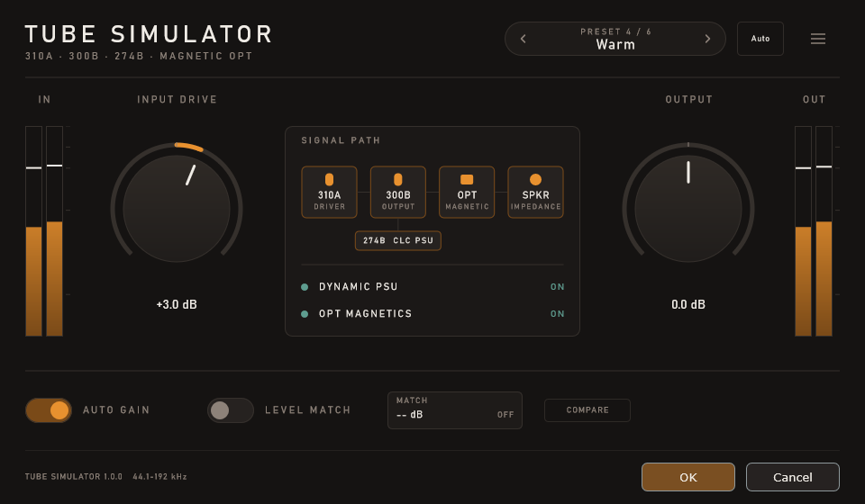
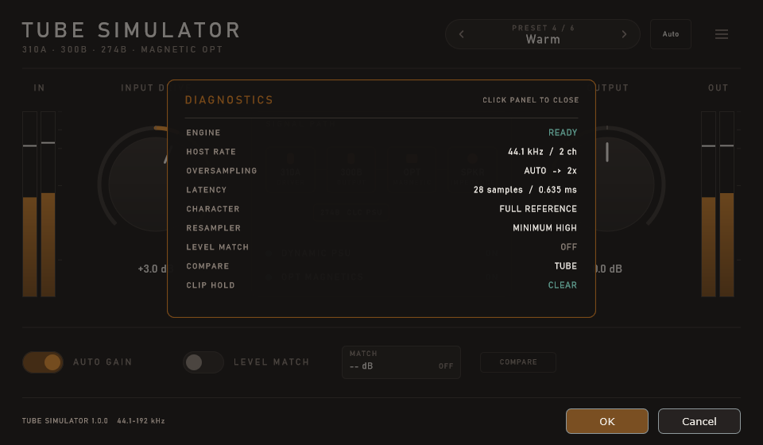

<div align="center">

# Tube Simulator

**A vacuum-tube amplifier modelling plug-in for Windows**

[](#requirements)
[](https://www.foobar2000.org/)
[](#license)

[Product site](https://moenium.net/tube-simulator/) ·
[Manual / English](https://moenium.net/tube-simulator/manual/1.0/en/introduction.html) ·
[日本語](https://moenium.net/tube-simulator/manual/1.0/ja/introduction.html) ·
[Deutsch](https://moenium.net/tube-simulator/manual/1.0/de-DE/introduction.html) ·
[Español](https://moenium.net/tube-simulator/manual/1.0/es-ES/introduction.html) ·
[Français](https://moenium.net/tube-simulator/manual/1.0/fr-FR/introduction.html) ·
[Italiano](https://moenium.net/tube-simulator/manual/1.0/it-IT/introduction.html) ·
[한국어](https://moenium.net/tube-simulator/manual/1.0/ko-KR/introduction.html) ·
[Português](https://moenium.net/tube-simulator/manual/1.0/pt-BR/introduction.html) ·
[Русский](https://moenium.net/tube-simulator/manual/1.0/ru-RU/introduction.html) ·
[简体中文](https://moenium.net/tube-simulator/manual/1.0/zh-CN/introduction.html) ·
[繁體中文](https://moenium.net/tube-simulator/manual/1.0/zh-TW/introduction.html) ·
[Language chooser](https://moenium.net/tube-simulator/manual/1.0/)
 [GitHub Releases](../../releases/latest) ·
 [Changelog](distribution/changelog.md) ·
 [日本語 README](README.ja.md)

</div>

---

Tube Simulator is a Windows audio plug-in that models the dynamic behaviour of
a vacuum-tube amplifier. It is available as both a foobar2000 v2.x 64-bit DSP
component and a 64-bit VST3 plug-in. Both versions use the same realtime
processing engine and configuration interface.

<div align="center">

</div>

## Contents

- [Features](#features)
- [Signal path](#signal-path)
- [Screenshots](#screenshots)
- [Requirements](#requirements)
- [Installation](#installation)
- [Getting started](#getting-started)
- [Download and verification](#download-and-verification)
- [Documentation](#documentation)
- [Feedback and bug reports](#feedback-and-bug-reports)
- [More from moenium](#more-from-moenium)
- [Supporting Tube Simulator](#supporting-tube-simulator)
- [License](#license)

## Features

- **Four Characters.** Standard, Dynamic PSU, OPT Magnetic, and Full Reference.
- **Tube-style drive and output control.** Input Drive and Output are provided
  independently.
- **Level tools.** Auto Gain, Level Match, and an independent COMPARE audition
  path.
- **Oversampling.** Auto, 1x, 2x, and 4x linear-phase processing.
- **Selectable resampling profiles.** Linear / Minimum phase with High,
  Standard, and Light quality choices.
- **Host-aware latency.** The public PDC values are 302, 263, 218, or 28
  samples depending on the selected profile.
- **Useful diagnostics.** Input/output meters, holds, Diagnostics, About, and
  Factory Preset controls are included in the same window.
- **Two plug-in formats.** Use the foobar2000 DSP component or load the VST3
  plug-in in a 64-bit VST3 host.

## Signal path

The central Signal Path view represents the modelled amplifier stages. The two
Character controls select the Dynamic PSU and OPT Magnetic branches:

| Dynamic PSU | OPT Magnetic | Character |
| --- | --- | --- |
| Off | Off | Standard |
| On | Off | Dynamic PSU |
| Off | On | OPT Magnetic |
| On | On | Full Reference |

Input Drive and Character define the voicing. Output, Auto Gain, Level Match,
COMPARE, Oversampling, and Resampler are separate controls and can be adjusted
without changing the selected voicing.

## Screenshots

<table>
<tr><th width="50%">Main window</th><th width="50%">Diagnostics</th></tr>
<tr>
<td></td>
<td></td>
</tr>
</table>

## Requirements

| | |
| --- | --- |
| OS | Windows |
| Host | foobar2000 v2.x, **64-bit only**, or a 64-bit VST3 host |
| CPU | x86-64 (Intel / AMD) |
| Output | Any audio device the host can open |
| Additional runtime | None |

The 32-bit version of foobar2000 and 32-bit VST hosts are not supported.
Higher sample rates, oversampling factors, and higher-quality Resampler
profiles use more CPU.

## Installation

### foobar2000 DSP component

1. Close foobar2000.
2. Double-click `foo_dsp_tube_simulator.fb2k-component`, or open
   **File → Preferences → Components** and choose **Install…**.
3. Select **Apply** to complete the installation.
4. Open **File → Preferences → Playback → DSP Manager**.
5. Move **Tube Simulator** into **Active DSPs**.
6. Select **Configure selected** to open the configuration window.

Installing the component alone does not add it to the playback chain.

### VST3 plug-in

Copy `VST3/TubeSimulator.vst3` to a VST3 plug-in folder scanned by the host,
then rescan plug-ins in the host.

### Uninstalling

For foobar2000, remove Tube Simulator from **Active DSPs**, then remove
**Tube Simulator DSP** from **Preferences → Components** and select **Apply**.
For VST3, remove `TubeSimulator.vst3` from the host's VST3 plug-in folder and
rescan.

## Getting started

Start with **Standard** or a Factory Preset, then adjust Input Drive and Output
slowly. For detailed guidance, see the [English manual](https://moenium.net/tube-simulator/manual/1.0/en/quick-start.html).

> **Turn your monitoring level down before changing Drive, Output, Character,
> or Oversampling.** These controls can change peak and perceived level.

Start with **Standard** or a Factory Preset, then adjust Input Drive and Output
slowly. Use **Level Match** when making a closer loudness comparison, and use
**COMPARE** to audition the reference path. Auto Gain and Level Match are
different tools.

The [Diagnostics screenshot](screenshots/tubesimulator_screenshot/tubesimulator_diagnostics.png)
shows the host rate, active processing state, Character, Oversampling, and
latency information available while checking a setup.

## Download and verification

The latest release is available from [GitHub Releases](../../releases/latest).
Each release page should list the distributed file name, SHA-256/SHA-512
checksums, and any release-specific notes.

On Windows PowerShell, calculate SHA-256 with:

```powershell
Get-FileHash .\TubeSimulator_*.zip -Algorithm SHA256
```

A matching checksum confirms that the downloaded archive is identical to the
file identified on the release page.

## Documentation

- [Online manual and language chooser](https://moenium.net/tube-simulator/manual/1.0/)
- [Changelog](distribution/changelog.md)
- [Bundled README (English)](distribution/readme_en.txt)
- [同梱README（日本語）](distribution/readme.txt)
- [EULA (English)](distribution/EULA_en.txt)
- [EULA（日本語正文）](distribution/EULA_jp.txt)
- [Third-party notices](distribution/third-party-notices.txt)
- [JUCE licence summary](licenses/JUCE_LICENSE.md)
- [Full embedded JUCE licence texts](licenses/JUCE_EMBEDDED_LICENSES.md)

## Feedback and bug reports

Bug reports, host compatibility reports, and other feedback are welcome.

**contact@moenium.net**

When reporting a problem, please include the Tube Simulator version, host and
host version, sample rate, Character, Oversampling, Resampler profile, and
reproduction steps. Diagnostics output is also useful.

## More from moenium

If you are looking for a broader multi-stage DSP for foobar2000, see
[Alauda](https://github.com/moenium-AI/Alauda).

Alauda and Tube Simulator are separate products.

## Supporting Tube Simulator

Tube Simulator is free, and it will stay free. If it has earned a place in your
listening chain and you would like to help it keep going, there is a Ko-fi page.

<p align="center">
  <a href="https://ko-fi.com/moenium">
    
  </a>
</p>

## License

Tube Simulator is **proprietary freeware**. It may be used free of charge for
personal, professional, and commercial purposes.

Redistribution, modification, reverse engineering, and other conditions are
governed by the bundled [EULA_en.txt](distribution/EULA_en.txt) /
[EULA_jp.txt](distribution/EULA_jp.txt). The Japanese EULA is authoritative.

This README is a summary only and does not modify or supersede the EULA.

### Bundled third-party software

- **JUCE 9.0.1** (JUCE 9 Starter licence), Raw Material Software Limited.
  JUCE is used for the configuration interface and VST3 implementation and is
  governed by its own licence terms.
- **Steinberg VST 3 SDK**, subject to its own SDK licence and trademark terms.
- **foobar2000 SDK**, subject to the foobar2000 project's own terms. foobar2000
  itself is not part of Tube Simulator and is not distributed with it.

See [third-party-notices.txt](distribution/third-party-notices.txt) and the
[JUCE licence documents](licenses/) for details.

---

Copyright © 2026 moenium · [moenium.net](https://moenium.net/)
